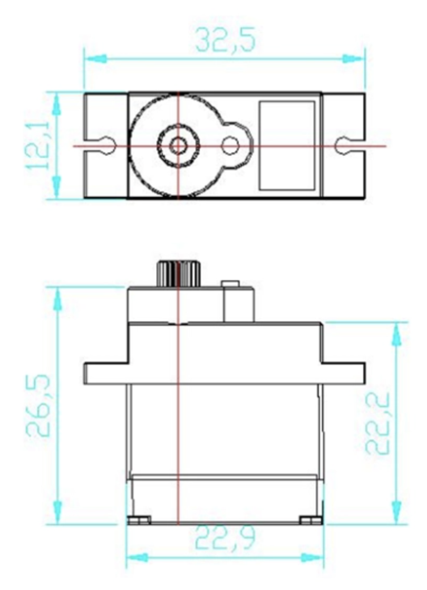

# RC_CAR

## Matériel

**2 servos moteurs continus** ([ref FT90R](https://www.gotronic.fr/art-servomoteur-ft90r-36020.htm?srsltid=AfmBOopCgoX5uPFUqWo006R-Ub7qdDmt9tJ0VlkPBpohfDMpsQIEAxP-)).

Dimensions: 22,5 x 12,1 x 22,4 mm

**ESP32 Feather Huzzah** ([ref Adafruit](https://www.gotronic.fr/art-carte-feather-huzzah32-esp32-ada3405-28105.htm?srsltid=AfmBOooTsTrmYxtxodtYTv0X1PElDsMUZGvBmOxg0DzgG-ocoIKLkrGn)).

Dimensions: 51 x 23 x 17 mm

**2 wagos**

Dimensions: 19 x 19 x 9 mm

**1 batterie**

Dimensions: 40 x 25 x 5 mm
Plusieurs dimensions ou facteurs de forme différents.

Possibilité de mettre une batterie externe type "de téléphone", mais + lourd et + grand.

## Code

Basé sur le template [ESP32 BLE de Valentin](https://ateliernum-templates.pages.dev/Arduino/ESP32_webBLE/).

Lien de l'interface web (il faut activer le bluetooth et autoriser chrome à se connecter au bluetooth) : https://luciemrc.github.io/RC_CAR/

Arduino : `ESP32_RC_CAR.ino`

.

Code web : `index.html`

.

*Interface web version desktop*

## Pour aller + loin

Changer de techno de communication ESP32 - web :
- [ESP32 soft access point](https://ateliernum-templates.pages.dev/Arduino/ESP32_softAP/) ?

